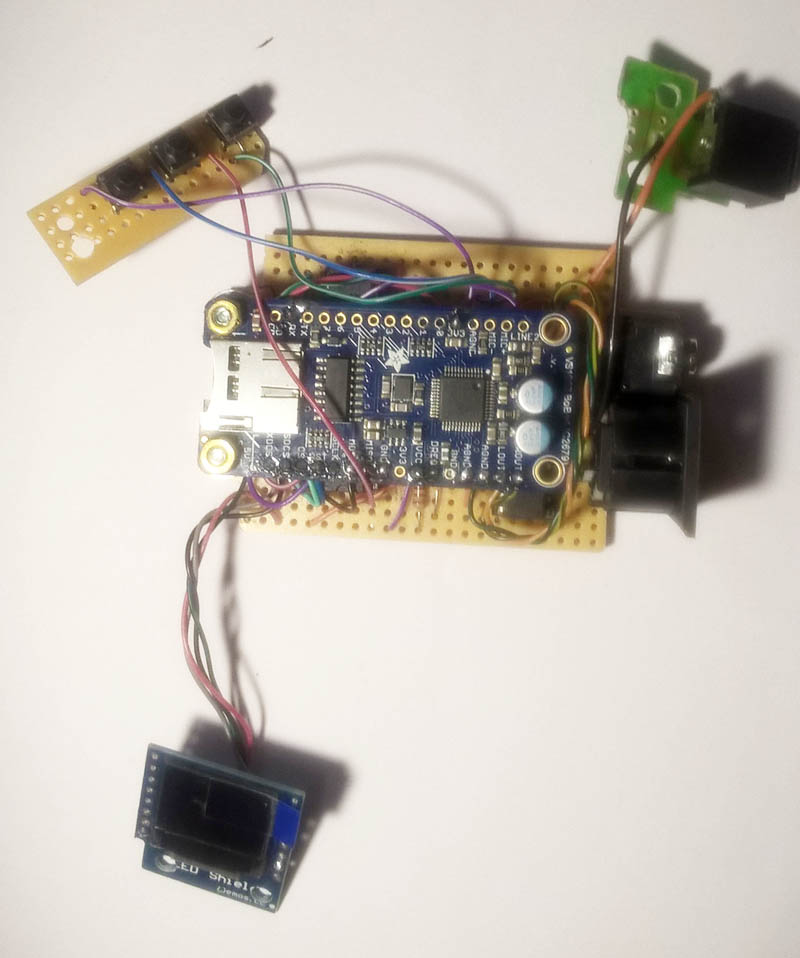
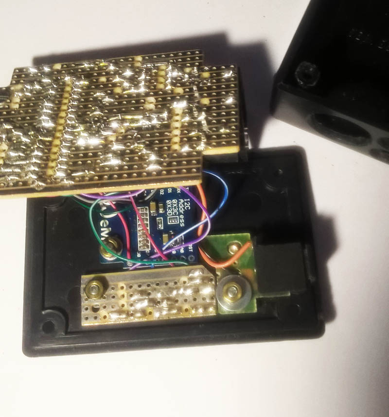
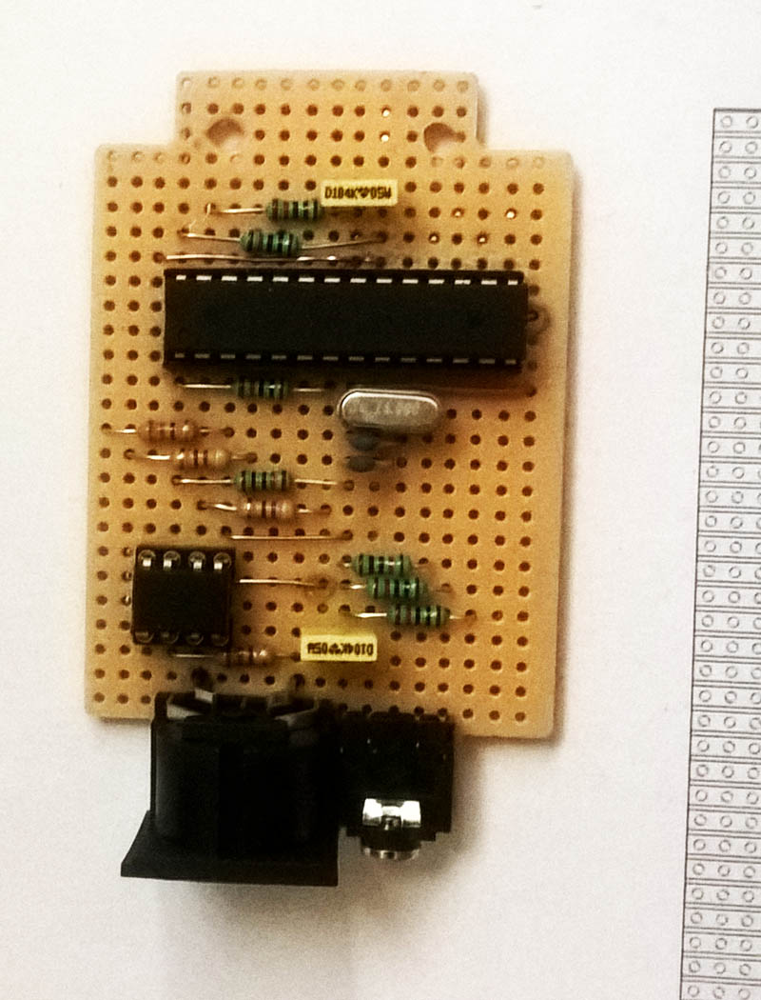

# VS1053 Micro Midi Synthesizer

### Introduction: 

This is also available as an [**instructable**](https://www.instructables.com/id/Micro-Midi-Synthesizer/), and demonstrates the use of the VLSI VS1053b Audio and Midi DSP chip in its real-time Midi mode. In this mode it acts as a 64 voice polyphonic GM (General Midi) Midi synthesizer. 

An ATMega328 MCU controls an OLED display, three buttons (Function Select and Up or Down, and passes the Midi data stream through to the audio DSP. The music board chosen was the Adafruit VS1053 codec breakout board, but a Sparkfun music breakout board was also successfully tested. The Adafruit VS1053b libraries were used instead of the much larger SFEMP3 Library (recommended by Sparkfun even though they also have their own set of libraries), because I found the Adafruit code easier to understand.

Most of the code used to control the audio/midi DSP was developed using an Arduino Uno connected to the audio/midi breakout board through a breadboard. After the functions were found to work satisfactory the Uno was used as a programmer for a standalone ATmega 328 which was then put on a small 30x20 size Veroboard together with the 6N139 opto-isolator IC required on the Midi input socket (a 5 pin DIN). Also connected was a small (64x48) OLED shield, three buttons, a Midi activity LED, and a +5 volt barrel connector for power and the audio stereo output connector added. The power requirements are very modest - about 20 mA at 5 volt.

### Parts List

* ATmega328 Micro 28 pin DIP + 28 pin DIP socket 
* 6N138 or 6N139 optoisolator + 4 pin DIP socket 
* Wemos 64x48 I2C OLED Display or similar 
* Adafruit VS1053b Codec breakout board 
* 3 miniature pushbuttons 
* 5 pin DIN Midi socket PCB mount preferred 
* Small LED any colour
* Barrel type power socket for the 5v supply 
* Stereo audio socket to connect to an amplifier or headphones 
* Resistors: 7 x 10k, 2 x 470 ohm, 2 x 220 ohm 
* Capacitors: 0.1uF 50v plastic, 10uf 25v electrolytic, 2 x 27 pF ceramic 
* Small pieces of Veroboard (30 strips by 20 columns, and 4 strips by 16 columns), ABS plastic enclosure about 85x55x25mm, wiring and a few screws nuts and washers.

### Construction

The lid of the enclosure houses the OLED Display, the three buttons that are mounted on another small piece of Veroboard, and the barrel power connector. The main Vero circuit board has two holes to fix the Music breakout board above the ATmega328. For connection details please refer to the Fritzing strip board diagram.
The programmed ATmega328 (please refer to the next section for the code) is then inserted into its socket followed by the 6N139 and everything is connected up.
The LED is used as a Midi activity indicator and was mounted on the front side of the enclosure. It is connected to the D2 output of the ATmega328 via a 470 ohm resistor.
The OLED Display use the 3.3 volt output from the Adafruit board for power - it requires less than 20 mA.
Try swapping the two Midi Din connections if you do not hear any audio when you first use the synth.

  
  
  

### Software

Details of the sketch that should be uploaded to the ATmega328 is given in MidA.ino. There are seven functions available:
Option P: Change Program - change the GM Midi Instrument from 1 to 128 (I used 0 to 127) such as a Piano or Synth sound. Option B: Change the Instrument bank between Melodic (Bank 0) and Percussion (Bank 1). Option V: Adjust the volume from 1 to 10. Option C: Change the Midi channel that the Synth will respond to. The choices are Channel 0, channel 1, channel 9 (percussion), channel 0 and 9, and channel 1 and 9. Option R: Switch the Reverb effect on or off. Option S: Save the current parameters to Eeprom memory (Up) or Read (Down) it back from the Eeprom memory. This is because settings are otherwise not saved when powering down. Option X: Send an all notes off message (Midi Reset).

An eighth option is not yet implemented - this will bypass the ATmega as a Midi filter and connect the output of the optoisolator directly to the Rx pin of the DSP board.

Note that the VS1053b boots in a real-time Midi mode by loading a 1039 byte compressed patch during booting - this also increases the size of the Midi buffer and filters system exclusive Midi data bytes. Details of this patch can be found on the VLSI website.

A slightly modified version of the Adafruit Graphics library had been used to cater for the 64x48 pixel resolution of the OLED Display - please refer to the links given at the end for Mr Mcauser. A list of the required libraries is given in the sketch code.

Importantly when the sketch is executed for the first time on the ATmega328 whether it is on an Uno or standalone, the code will load parameter presets from the ATmega328 Eeprom that may not be valid. In that case you can either write all zeroes to the Eeprom using the X option with the down button, or comment out the line in the void setup function that loads values from the Eeprom when it is first started, adjust your instruments etc. to your liking, and then save your presets with the S option Up button.
Credit is given to all the persons and entities mentioned for their code and libraries..

### Links

* VLSI: http://www.vlsi.fi/en/home.html
* Adafruit: https://www.adafruit.com/product/1381
* Github VS1053b: https://github.com/adafruit/Adafruit_VS1053_Library
* Github Graphics: https://github.com/mcauser/Adafruit_SSD1306/tree/esp8266-64x48
* Oled: https://wiki.wemos.cc/products:d1_mini_shields:oled_shield
* Sparkfun: https://www.sparkfun.com/products/12660

